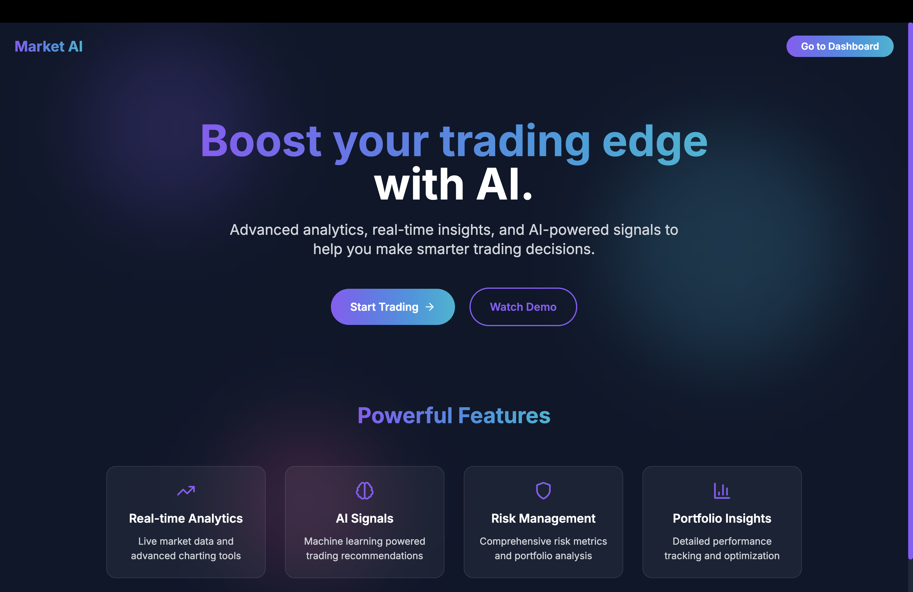
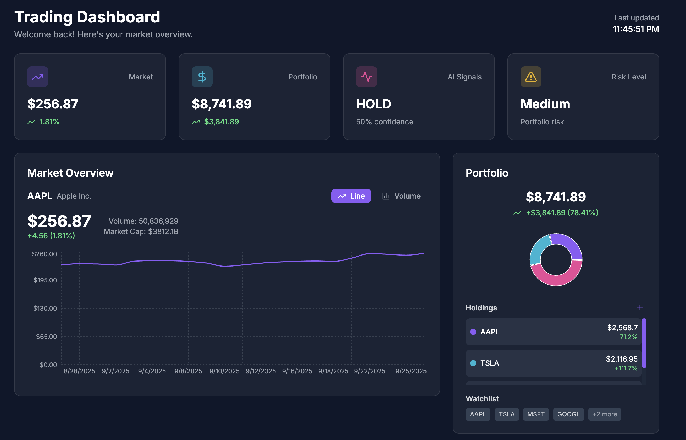
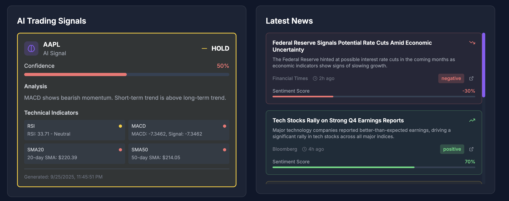
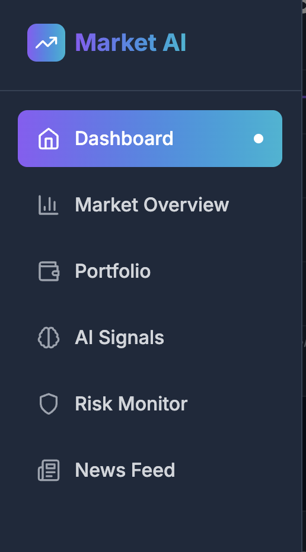
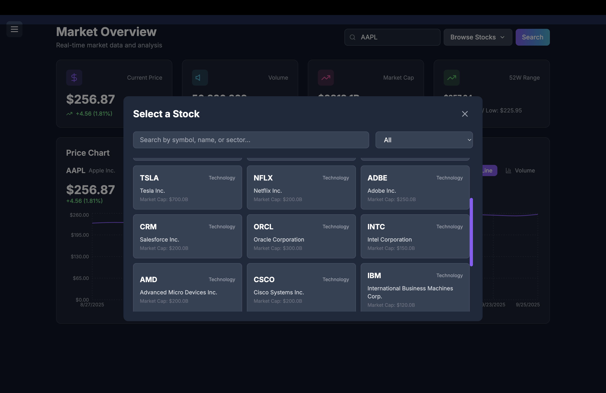
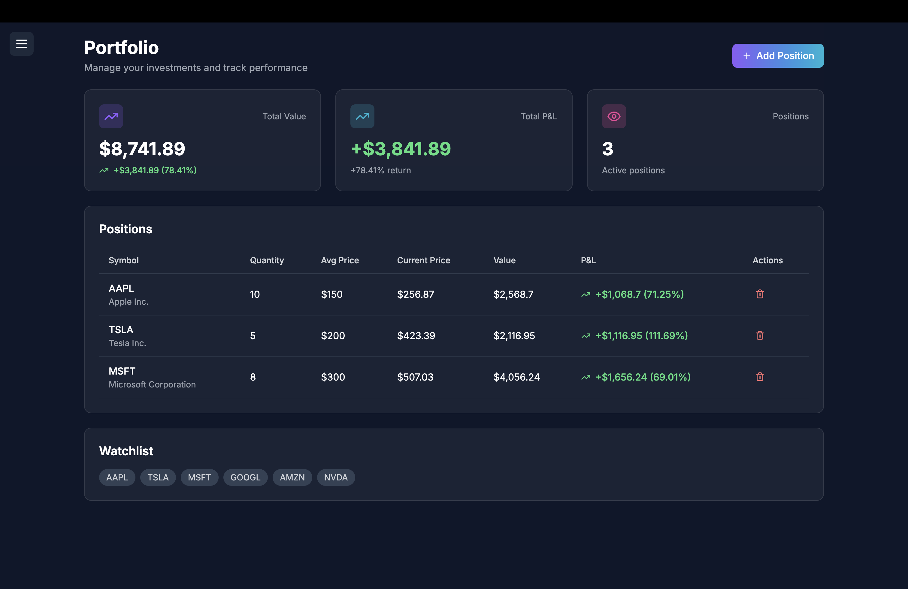
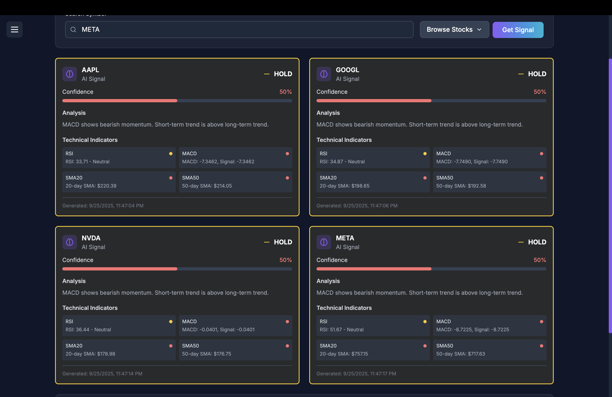
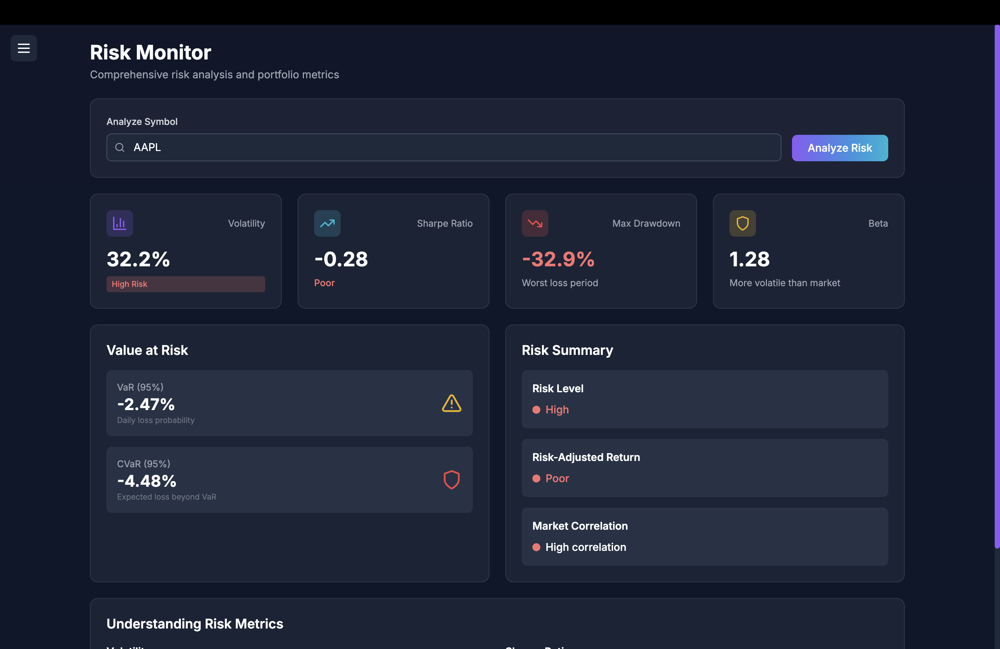
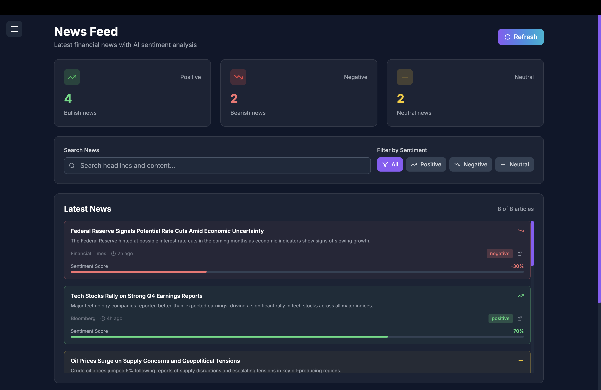

# Market AI - Trading Analytics Platform

A comprehensive full-stack trading analytics platform built with Next.js, TypeScript, and AI-powered insights. Features real-time market data, portfolio management, AI trading signals, risk analysis, and sentiment analysis.

## 📸 Screenshots

### Landing Page

*Modern hero section with animated backgrounds and feature highlights*

### Trading Dashboard

*Main dashboard with market overview, portfolio summary, and AI signals*

### AI Trading Signals

*AI-powered trading recommendations with technical analysis*

### Navigation Sidebar

*Collapsible sidebar with smooth navigation and modern design*

### Stock Selection Modal

*Comprehensive stock selector with 100+ stocks across 10 sectors*

### Portfolio Management

*Portfolio tracking with positions, P&L, and watchlist management*

### AI Signals Dashboard

*AI signals grid with technical indicators and confidence scores*

### Risk Monitor

*Comprehensive risk analysis with VaR, CVaR, and volatility metrics*

### News Feed

*Financial news with AI sentiment analysis and filtering*

## 🚀 Features

### Frontend
- **Modern UI/UX**: Dark theme with neon purple/blue gradients and glass effects
- **Responsive Design**: Works perfectly on desktop and mobile devices
- **Smooth Animations**: Framer Motion for page transitions and interactions
- **Interactive Charts**: Real-time line and volume charts using Recharts
- **Hover Effects**: Beautiful glow effects and scale animations on all interactive elements
- **Collapsible Sidebar**: Modern navigation with smooth slide-in/out animations
- **Stock Selector**: Comprehensive modal with 100+ stocks across 10 sectors
- **Clickable Elements**: All dashboard cards, news articles, and buttons are fully interactive

### Backend
- **Next.js API Routes**: Serverless backend with TypeScript
- **Real Market Data**: Integration with Yahoo Finance API for live data
- **Portfolio Management**: JSON-based portfolio tracking with real-time updates
- **AI Signals**: Technical analysis with RSI, MACD, and moving averages
- **Risk Metrics**: Volatility, Sharpe ratio, VaR, and CVaR calculations
- **News Feed**: Financial news with AI sentiment analysis
- **Stock Database**: 100+ top stocks with sector classification and market cap data

### AI Integration
- **Technical Analysis**: Automated calculation of technical indicators
- **Sentiment Analysis**: AI-powered news sentiment scoring using OpenAI
- **Trading Signals**: Buy/Sell/Hold recommendations with confidence scores
- **Risk Assessment**: Comprehensive risk metrics and portfolio analysis
- **Natural Language Processing**: AI-powered news analysis and summaries

### Recent Updates
- ✅ **Fixed Chart Issues**: Replaced non-existent candlestick components with working volume charts
- ✅ **Added Stock Selection**: 100+ stocks across 10 major sectors with search and filtering
- ✅ **Enhanced UI/UX**: Added hover glow effects and smooth animations throughout
- ✅ **Made Everything Clickable**: All dashboard cards, news articles, and buttons are now interactive
- ✅ **Centered Layout**: Fixed left gap issue with collapsible sidebar design
- ✅ **Improved Navigation**: Smooth sidebar animations and better mobile experience

## 🛠️ Tech Stack

- **Framework**: Next.js 14 (App Router)
- **Language**: TypeScript
- **Styling**: TailwindCSS
- **Animations**: Framer Motion
- **Charts**: Recharts
- **Icons**: Lucide React
- **Data Sources**: Yahoo Finance API
- **Deployment**: Vercel-ready

## 📦 Installation

1. **Clone the repository**
   ```bash
   git clone <repository-url>
   cd market-ai-trading-platform
   ```

2. **Install dependencies**
   ```bash
   npm install
   ```

3. **Set up environment variables**
   Create a `.env.local` file in the root directory:
   ```env
   # Optional: Alpha Vantage API Key (for additional data)
   ALPHA_VANTAGE_API_KEY=your_alpha_vantage_api_key_here
   
   # Optional: Finnhub API Key (for news)
   FINNHUB_API_KEY=your_finnhub_api_key_here
   
   # Optional: OpenAI API Key (for enhanced AI features)
   OPENAI_API_KEY=your_openai_api_key_here
   ```

4. **Run the development server**
   ```bash
   npm run dev
   ```

5. **Open your browser**
   Navigate to [http://localhost:3000](http://localhost:3000)

## 🎯 Usage

### Landing Page
- Modern hero section with animated floating shapes
- Feature overview with glass-effect cards
- Call-to-action buttons with hover effects
- Responsive design for all devices

### Trading Dashboard
- **Market Overview**: Real-time stock charts with 100+ stock selection
- **Portfolio**: Track positions, P&L, and watchlist with interactive cards
- **AI Signals**: AI-powered trading recommendations with technical analysis
- **Risk Monitor**: Comprehensive risk analysis with VaR and CVaR metrics
- **News Feed**: Financial news with AI sentiment analysis and filtering

### Key Features
1. **Stock Selection**: Browse 100+ stocks across 10 sectors with search and filtering
2. **Interactive Charts**: Switch between line and volume charts with smooth animations
3. **Portfolio Management**: Add/remove positions and track performance with real-time updates
4. **AI Analysis**: Get automated trading signals with confidence scores and technical indicators
5. **News Sentiment**: View market sentiment from financial news with clickable articles
6. **Hover Effects**: Beautiful glow effects and animations on all interactive elements
7. **Collapsible Navigation**: Modern sidebar that slides in/out smoothly
8. **Responsive Design**: Works seamlessly on all devices with centered content

## 🔧 API Endpoints

- `GET /api/market?symbol=AAPL` - Fetch market data and charts
- `GET /api/portfolio` - Get portfolio data
- `POST /api/portfolio` - Add/update portfolio positions
- `GET /api/signals?symbol=AAPL` - Generate AI trading signals
- `GET /api/risk?symbol=AAPL` - Calculate risk metrics
- `GET /api/news?limit=10` - Fetch financial news
- `POST /api/news` - Analyze sentiment of text

## 📊 Data Sources

- **Yahoo Finance**: Primary source for market data and historical prices
- **Stock Database**: 100+ top stocks across 10 major sectors (Technology, Healthcare, Financial Services, etc.)
- **Technical Analysis**: Custom calculations for RSI, MACD, moving averages
- **Risk Metrics**: VaR, CVaR, volatility, and Sharpe ratio calculations
- **News APIs**: Financial news with sentiment analysis
- **OpenAI Integration**: AI-powered sentiment analysis and natural language processing

## 🆕 Recent Improvements

### Version 2.0 Updates
- **Stock Selection**: Added comprehensive stock database with 100+ stocks
- **UI/UX Enhancements**: Beautiful hover effects and smooth animations
- **Interactive Elements**: Made all dashboard cards and news articles clickable
- **Layout Fixes**: Centered content with collapsible sidebar navigation
- **Chart Improvements**: Fixed chart components and added volume visualization
- **Mobile Experience**: Improved responsive design and touch interactions
- **Performance**: Optimized animations and reduced bundle size

## 🚀 Deployment

The application is ready for deployment on Vercel:

1. **Push to GitHub**
2. **Connect to Vercel**
3. **Deploy automatically**

No additional configuration required!

## 🎨 Customization

### Styling
- Modify `tailwind.config.js` for theme customization
- Update `app/globals.css` for global styles
- Customize component styles in individual files

### API Integration
- Add real API keys in environment variables
- Extend API routes for additional data sources
- Implement database integration for persistent data

### Features
- Add more technical indicators
- Implement user authentication
- Add more chart types and analysis tools
- Integrate with additional data providers

## 🎨 Design Features

### Visual Design
- **Dark Theme**: Professional dark background with neon purple/blue accents
- **Glass Effects**: Subtle transparency and backdrop blur for modern look
- **Gradient Accents**: Purple to blue gradients for buttons and highlights
- **Hover Animations**: Scale effects and glow animations on interactive elements
- **Typography**: Clean, modern fonts with proper hierarchy

### User Experience
- **Intuitive Navigation**: Collapsible sidebar with smooth animations
- **Interactive Elements**: All cards, buttons, and articles are clickable
- **Real-time Updates**: Live data updates and smooth transitions
- **Responsive Layout**: Perfect on desktop, tablet, and mobile devices
- **Accessibility**: Proper contrast ratios and keyboard navigation

## 🤝 Contributing

1. Fork the repository
2. Create a feature branch
3. Make your changes
4. Test thoroughly
5. Submit a pull request

## 📄 License

This project is licensed under the MIT License.

## 🆘 Support

For support or questions:
- Create an issue in the repository
- Check the documentation
- Review the code comments

## 🔮 Future Enhancements

- [ ] Real-time WebSocket connections
- [ ] Advanced charting with TradingView
- [ ] User authentication and profiles
- [ ] Database integration (PostgreSQL/MongoDB)
- [ ] Mobile app (React Native)
- [ ] Advanced AI models for predictions
- [ ] Social trading features
- [ ] Paper trading simulation
- [ ] Advanced portfolio optimization
- [ ] Multi-language support

---

**Built with ❤️ using Next.js, TypeScript, and modern web technologies.**
